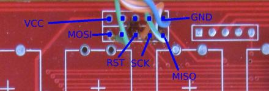
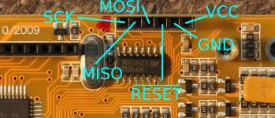
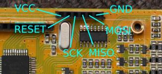
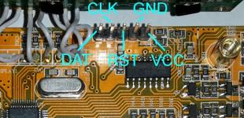

Flashing
========

Flashing: atmega32 CPU charger
-------------------------------

- check ISP pins on your chargers PCB board, at least GND and VCC:
  - G.T. POWER A6-10 200W:  
  
  - IMAX B6 - original:  
  
  - IMAX B6 - clone:  
  

- select the appropriate [hex file](flashing.md#differences)
- flasing using [avrdude:](http://www.nongnu.org/avrdude/)
<pre>
(try to make a backup)
avrdude.exe -patmega32 -cusbasp -Uflash:r:flash.hex:r -Ulfuse:r:lfuse.hex:r -Uhfuse:r:hfuse.hex:r -Ueeprom:r:eeprom.hex:r

(flash cheali-charger into program memory)
avrdude.exe -patmega32 -cusbasp -Uflash:w:cheali-charger-[VERSION].hex:a

(you may want to change "-cusbasp" according to your programmer)
</pre>
- or use any other avr programming tool
WARNING: Do not touch the AVR fuses, setting them wrong could destroy the charger.

Flashing: nuvoton M0517LBN CPU charger
--------------------------------------

check ISP pins on your chargers PCB board, at least GND and VCC:  

- [Bu-Link]:(http://www.aliexpress.com/item/Free-Shipping-1SET-Bu-Link-Compatible-Nuvoton-Nu-Link-for-all-Cortex-M0-MINI51-M052-NUC120/1570055317.html)):
  
  - make the appropriate cables
  - use: [nuvoton icp programming tool](http://download.nuvoton.com/NuvotonMOSS/DownloadService/Member/DocumentsInfo.aspx?tp_GUID=SW0520101208200310)
   (try to make a backup first!)

Differences between cheali-charger versions
-------------------------------------------
